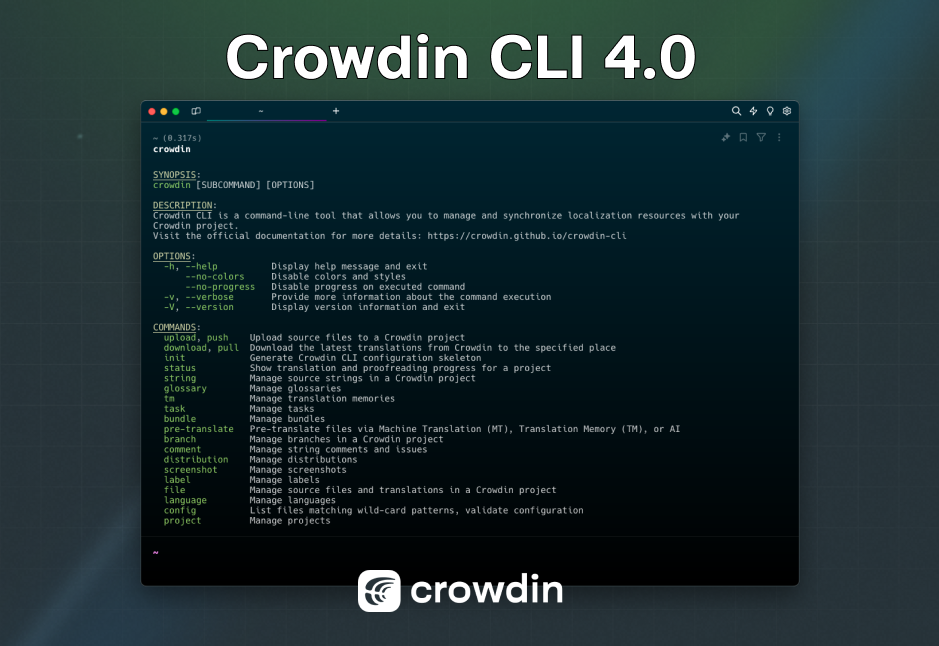

Today we are happy to announce Crowdin CLI **4.0**! 🥳



It has been almost five years since the release of Crowdin CLI 3.0. During this time, we have received extensive feedback from our users and worked diligently to improve the tool. As a result, we've made many changes and improvements.

The new version of Crowdin CLI introduces a lot of new features and enhancements. We've added new commands, updated existing ones, and significantly improved the overall user experience.

This post is intended to highlight the most important changes and help you migrate from CLI 3.x with ease. It is not a comprehensive guide, but rather a list of the most important changes.

<!--truncate-->

## Requirements

As part of this release, the minimum Java version has been updated to **17 LTS**.

## New commands

- [`crowdin config`](/commands/crowdin-config)
- [`crowdin project`](/commands/crowdin-project)
- [`crowdin language`](/commands/crowdin-language)
- [`crowdin branch clone`](/commands/crowdin-branch-clone)
- [`crowdin branch merge`](/commands/crowdin-branch-merge)
- [`crowdin completion`](/autocompletion)

## New command options

| <div style={{width:150 + 'px'}}>Command</div> | Option/Description                                                                                                 |
|-----------------------------------------------|--------------------------------------------------------------------------------------------------------------------|
| `init`                                        | <kbd>--quiet</kbd> option to skip interactive input prompts                                                        |
| `string add`                                  | <kbd>--branch</kbd> option to specify the branch to which the new string should be added                           |
| `string list`                                 | <kbd>--directory</kbd> and <kbd>--scope</kbd> options to filter strings by directory and scope                     |
| `pre-translate`                               | <kbd>--file</kbd> option to specify the file(s) in the Crowdin project to pre-translate                            |
| `pre-translate`                               | <kbd>ai</kbd> method and <kbd>--ai-prompt</kbd> parameter to allow pre-translation via AI                          |
| `file upload`                                 | <kbd>--type</kbd> and <kbd>--parser-version</kbd> options to specify the file type and parser version respectively |
| `file upload`                                 | <kbd>--context</kbd> option to provide a context about the whole file                                              |
| `file list`                                   | <kbd>--verbose</kbd> option to show more information about the files                                               |
| `language list`                               | <kbd>--all</kbd> option to list all languages for the current account                                              |

## Command updates

### Pre-translate

We've made significant changes to the [`pre-translate`](/commands/crowdin-pre-translate) command. The command now requires the <kbd>--file</kbd> parameter for file-based projects. The <kbd>--file</kbd> parameter determines which files to pre-translate. Previously, the command relied on the current configuration, and it was only possible to pre-translate the files that matched the configuration patterns. Now you can specify any file(s) in the Crowdin project to pre-translate.

Tip: Use the [`file list`](/commands/crowdin-file-list) command to get the file paths in the current project.

### String

* The [`string edit`](/commands/crowdin-string-edit) command changes:
  * Moved <kbd>id</kbd> to a parameter instead of a command option.
  * Now <kbd>--identifier</kbd> is used as an option to edit and not to find the needed string.
* The [`string delete`](/commands/crowdin-string-delete) command changes:
  * Moved <kbd>id</kbd> to a parameter instead of a command option. Now only 1 string can be removed at a time.
  * Removed the <kbd>--text</kbd> and <kbd>--identifier</kbd> options. Only ID is used as a string identifier.
* The `comment` command has been replaced with the [`comment add`](/commands/crowdin-comment-add) command.

```diff
-crowdin string add Download --file main/src/strings.xml --identifier "download"
+crowdin string add Download --file src/strings.xml --branch main --identifier "download"

-crowdin string edit --id 12 --text new
+crowdin string edit 12 --text new

-crowdin string delete --id 12
+crowdin string delete 12
```

### List

* The `list branches` command has been replaced with the [`branch list`](/commands/crowdin-branch-list) command.
* The `list sources` command has been replaced with the [`config sources`](/commands/crowdin-config-sources) command.
* The `list translations` command has been replaced with the [`config translations`](/commands/crowdin-config-translations) command.
* The `list project` command has been replaced with the [`file list`](/commands/crowdin-file-list) command.
* The `list languages` command has been replaced with the [`language list`](/commands/crowdin-language-list) command.

```diff
-crowdin list branches
+crowdin branch list

-crowdin list project
+crowdin file list

-crowdin list sources
+crowdin config sources

-crowdin list translations
+crowdin config translations

-crowdin list languages
+crowdin language list
```

:::info
The default language code for the `language list` command output has been changed from `two_letters_code` to `id`.

This change makes it more convenient, as the `id` is used consistently for the `--language` parameter across various commands.
:::

### Glossary

The <kbd>--name</kbd> option has been removed from the `upload` and `download` commands, and the <kbd><id\></kbd> parameter is now used instead:

```diff
-crowdin glossary download --id <id>
-crowdin glossary download --name <name>
+crowdin glossary download <id>

-crowdin glossary upload <file> --name <name>
+crowdin glossary upload <file> --id <id>
```

Tip: Use the [`glossary list`](/commands/crowdin-glossary-list) command to get the `id`.

### TM

The <kbd>--name</kbd> option has been removed from `upload` and `download` commands, and the <kbd><id\></kbd> parameter is now used instead:

```diff
-crowdin tm download --id <id>
-crowdin tm download --name <name>
+crowdin tm download <id>

-crowdin tm upload <file> --name <name>
+crowdin tm upload <file> --id <id>
```

Tip: Use the [`tm list`](/commands/crowdin-tm-list) command to get the `id`.

### Screenshot

The <kbd>--name</kbd> option has been replaced with the <kbd><id\></kbd> parameter for the `delete` command because there can be multiple screenshots with the same name:

```diff
-crowdin screenshot delete <name>
+crowdin screenshot delete <id>
```

Tip: Use the [`screenshot list`](/commands/crowdin-screenshot-list) command to get the `id`.

### Init

The `generate` alias has been removed:

```diff
-crowdin generate
+crowdin init
```

### Lint

The `lint` command has been replaced with the [`config lint`](/commands/crowdin-config-lint) command:

```diff
- crowdin lint
+ crowdin config lint
```

### Bundle

The `download bundle` command has been replaced with the [`bundle download`](/commands/crowdin-bundle-download) command.

## Exit codes

This release also includes more exit codes (previously we only had `0` for success and `1` for failure).

See the [official documentation](/exit-codes) for more details.

## Environment variables

Previously, it was necessary to specify the environment variables in the configuration file in order to load the configuration from them.

Now the CLI can automatically pick up the environment variables if they are set in the shell. The supported environment variables are:

- `CROWDIN_PROJECT_ID`
- `CROWDIN_PERSONAL_TOKEN`
- `CROWDIN_BASE_PATH`
- `CROWDIN_BASE_URL`

Thanks to this change, it's now easier to work with the CLI in CI/CD environments, especially in the no-configuration-file use case.

Visit the [Configuration File](/configuration#environment-variables) article for more details.

## Deprecations and backward compatibility

### Download targets

The deprecated `download targets` command has been removed. The configuration file no longer supports the `targets` section as well. Use [Bundles](/commands/crowdin-bundle) instead.

### Task command

Removed backward compatibility for file numeric id in the [`task add`](/commands/crowdin-task-add) command. Now only file path is supported:

```diff
-crowdin task add --file 12 --language uk
+crowdin task add --file src/strings.xml --language uk
```

## Command output updates

In this release, we've also reviewed and improved the output of many commands to make them more informative and user-friendly. Changes include `list`, `add`, `upload`, `download`, `delete`, and other commands for various resources.

:::tip
Need help or have questions? [Let's discuss it](https://github.com/crowdin/crowdin-cli/discussions/781)!
:::
